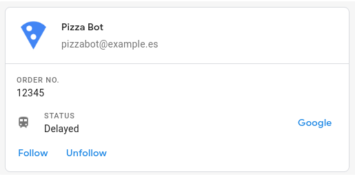
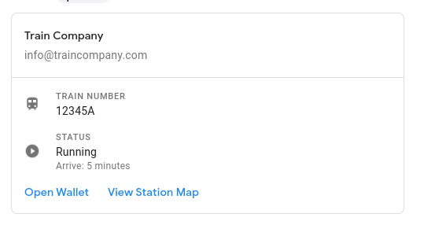

# TS Google Chat
A simple library to compose and send messages through Google Chat using Webhook. It allows sending from simple text messages to interactive letters.



## SimpleMessage
Once you've got the URL you need to send the hooks to, create the following file. It is the simplest email that can be sent: it sends plain text through the sender.

```javascript
//Webpack or Framework (client)
import {SimpleMessage, GoogleChatSender} from "ts-google-chat";  
// Node.js
const {SimpleMessage, GoogleChatSender} = require('ts-google-chat');  
  
  
const message = new SimpleMessage('It works');  
const sender = new GoogleChatSender({url: 'https://chat.google.com/.....'});  
sender.send(message);
```

The `SimpleMessage` supports some formatting following the Markdown format:

```javascript
const message = new SimpleMessage('');  
message  
  .addLine()  
    .addBold('Really')  
    .addLine()  
    .addItalic('Test')  
    .addMonospaceText('this')  
    .addStrike('API');  
  
const sender = new GoogleChatSender({url: 'https://chat.google.com/.....'});  
sender.send(message);
```

## Message
The `Message` allows you to add cards, sections and some UI components that allow you to create very attractive interfaces and even interact with the user.

```javascript
import {ButtonGroup, Card, GoogleChatSender, Icon, KeyValue, Message, Section, TextButton} from "ts-google-chat"
// or 
const {ButtonGroup, Card, GoogleChatSender, Icon, KeyValue, Message, Section, TextButton} = require('ts-google-chat')  


const train = new KeyValue({topLabel: 'Train Number', content: '12345A', icon: new Icon('TRAIN')});  
const status = new KeyValue({topLabel: 'Status', content:'Running', bottomLabel:'Arrive: 5 minutes', icon: new Icon('VIDEO_PLAY')});  
const buttons = new ButtonGroup([  
    new TextButton('Open Wallet', 'http://google.es'),  
  new TextButton('View Station Map', 'http://google.es')  
]);  
  
const section = new Section([train, status, buttons]);  
const card = new Card({title: 'Train Company', subTitle: 'info@traincompany.com', sections: [section]});  
const message = new Message(card);  

const sender = new GoogleChatSender({url: 'https://chat.googleapis.com/v1/spaces/xxx.......'});  
sender.send(message);
```

